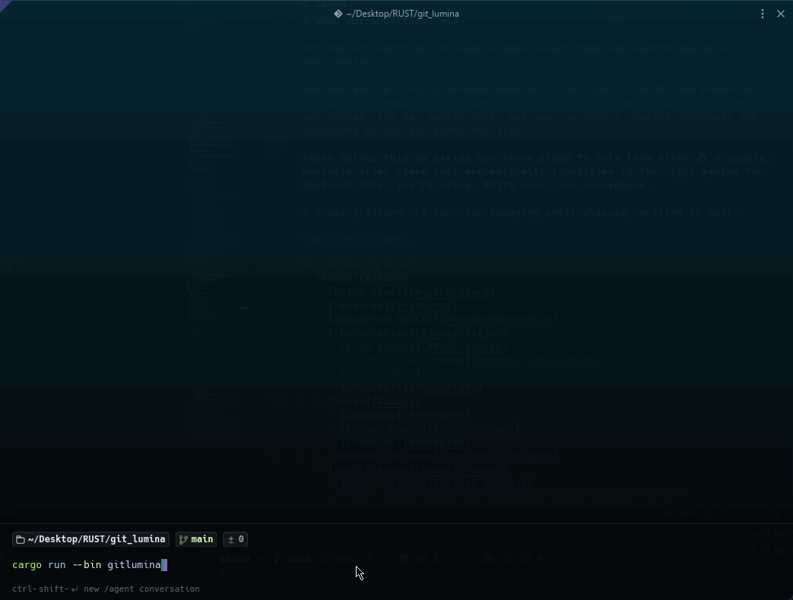

# GitLumina TUI

A terminal-based Git client inspired by GitKraken, built with Rust.

## Features

- **Commit Graph** — Visual commit history with per-branch columns, hash-stable branch colors, merge connectors (`◉──╮`), and fast-forward alias dots (`●──●`)
- **File Staging** — Stage/unstage files (single or all), view diffs, write commit messages
- **Branch Management** — Create, checkout, and delete branches
- **Push / Pull / Fetch** — Full remote operations with SSH key and credential helper support
- **Mouse Support** — Click to select commits, files, branches, and tabs
- **Scrollable Diff** — Mouse wheel and PageUp/PageDn scroll through diffs with a scrollbar indicator
- **Auto-Refresh** — Toggle automatic repository refresh every 2 seconds with `[AUTO]` status indicator



## Installation

```bash
cargo install git-lumina
```

This installs both `lumina` and `gitlumina` commands globally. Then navigate to any Git repository and run:

```bash
lumina
```

## Run via Docker

A pre-built image is also available. With Docker you can run GitLumina without installing Rust, `libgit2`, or any system dependencies.

### 1. Pull the image

```bash
# GitHub Container Registry
docker pull ghcr.io/helene-nguyen/git-lumina:latest

# or Docker Hub (replace with your account if you publish your own)
docker pull <dockerhub-username>/git-lumina:latest
```

Use a version tag (e.g. `1.0.0`) instead of `latest` to pin to a specific release.

### 2. Run it against a repo — and why you need `-v`

Docker containers are **isolated from the host filesystem**. The container has its own `/` and **cannot see your current directory** unless you explicitly grant access. GitLumina expects a Git repository at `/repo` inside the container, so you bind-mount your host repo to that path with the `-v` flag.

From inside the Git repo you want to inspect:

```bash
docker run --rm -it -v "$(pwd):/repo" ghcr.io/helene-nguyen/git-lumina:latest
```

What each flag does:

| Flag                | Purpose                                                                |
| ------------------- | ---------------------------------------------------------------------- |
| `--rm`              | Remove the container when it exits (no clutter)                        |
| `-it`               | Attach an interactive TTY — the TUI needs this                          |
| `-v "$(pwd):/repo"` | Mount the host's current directory at `/repo` inside the container     |

Without `-v`, the container sees an empty `/repo` and fails with `Failed to find a Git repository`. That is by design — there is no Dockerfile trick that bypasses it.

### 3. Shell-specific notes (Windows)

**PowerShell:**

```powershell
docker run --rm -it -v "${PWD}:/repo" ghcr.io/helene-nguyen/git-lumina:latest
```

**WSL (Ubuntu / Debian inside Windows):** works with the standard Linux command above. Open your WSL shell first — do **not** run Docker commands from Git Bash.

**Git Bash on Windows:** *not recommended*. MSYS rewrites Unix-style paths (`/repo` becomes `C:\Program Files\Git\repo`) and breaks the `-v` argument. Use WSL or PowerShell instead.

### 4. Make it ergonomic — set an alias once

Typing the full command every time is tedious. Set an alias once:

```bash
# Linux / macOS / WSL — add to ~/.bashrc or ~/.zshrc
alias lumina='docker run --rm -it -v "$(pwd):/repo" ghcr.io/helene-nguyen/git-lumina:latest'
```

```powershell
# Windows — add to $PROFILE
function lumina { docker run --rm -it -v "${PWD}:/repo" ghcr.io/helene-nguyen/git-lumina:latest @args }
```

Then from any repo:

```bash
cd path/to/your/repo
lumina
```

## Prerequisites

- [Rust toolchain](https://rustup.rs/) (1.85+)
- `libgit2` dev headers:
  - **Ubuntu/Debian**: `sudo apt install libgit2-dev pkg-config`
  - **macOS**: bundled automatically via `git2` crate
  - **Arch**: `sudo pacman -S libgit2`
- A Git repository to open

## Developers Build & Run

Clone the repo and build with:

```bash
cargo build --release

# Run inside any Git repository
cd /path/to/your/repo
lumina
# or
gitlumina
```

> After `cargo install --path .`, both `lumina` and `gitlumina` commands are available globally.

## Keybindings

### Global

| Key         | Action              |
| ----------- | ------------------- |
| `1` `2` `3` | Switch tabs         |
| `Tab`       | Next tab            |
| `Shift+Tab` | Previous tab        |
| `↑`/`k`     | Move up             |
| `↓`/`j`     | Move down           |
| `P`         | Push to remote      |
| `L`         | Pull from remote    |
| `F`         | Fetch from remote   |
| `r`         | Refresh all data    |
| `a`         | Toggle auto-refresh |
| `m`         | Toggle mouse capture (select/copy in terminal) |
| `?`         | Toggle help popup   |
| `q`         | Quit                |
| `Ctrl+C`    | Force quit          |

### Files Tab

| Key           | Action                  |
| ------------- | ----------------------- |
| `←`/`→`       | Cycle pane focus        |
| `s`           | Stage selected file     |
| `u`           | Unstage selected file   |
| `S`           | Stage all files         |
| `U`           | Unstage all files       |
| `c`           | Start typing commit msg |
| `Enter`       | Commit (in commit pane) |
| `Esc`         | Cancel editing          |
| `PgUp`/`PgDn` | Scroll diff view        |

### Branches Tab

| Key     | Action                   |
| ------- | ------------------------ |
| `Enter` | Checkout selected branch |
| `n`     | Create new branch        |
| `d`     | Delete selected branch   |

### Mouse

| Action           | Effect                                |
| ---------------- | ------------------------------------- |
| Left click       | Select commits, files, branches, tabs |
| Scroll wheel     | Scroll diff view or navigate lists    |
| Click commit msg | Focus commit input and start editing  |

## Architecture

```
src/
├── lib.rs          # Public `run()`, terminal setup, event loop, mouse routing
├── app.rs          # Application state, click regions, business logic
├── ui.rs           # All rendering (ratatui widgets, scrollbar, popups)
├── git_ops.rs      # Git operations (git2 wrapper + push/pull/fetch)
└── bin/
    ├── lumina.rs       # Thin binary entry point → calls `git_lumina::run()`
    └── gitlumina.rs    # Thin binary entry point → calls `git_lumina::run()`
```

The architecture cleanly separates concerns:

- **`git_ops`** — Pure Git operations including remote push/pull/fetch with credential discovery
- **`app`** — State machine with click region tracking for mouse support
- **`ui`** — Pure rendering function of `App` state → screen output, with diff scrollbar
- **`lib::run`** — Event loop handling keyboard, mouse clicks, and scroll events; reused by both bin targets

## Remote Operations

Push/pull uses `git2`'s native transport with automatic credential discovery:

1. **SSH Agent** — Tries `ssh-agent` first
2. **SSH Keys** — Falls back to `~/.ssh/id_ed25519`, `id_rsa`, `id_ecdsa`
3. **Credential Helper** — Uses Git's configured credential helper for HTTPS

Pull performs a **fast-forward only** merge. If the branch has diverged, it will tell you to merge or rebase manually.

## Dependencies

| Crate       | Purpose                         |
| ----------- | ------------------------------- |
| `ratatui`   | TUI framework (widgets, layout) |
| `crossterm` | Terminal I/O + mouse events     |
| `git2`      | Rust bindings for libgit2       |
| `anyhow`    | Error handling                  |
| `chrono`    | Timestamp formatting            |
